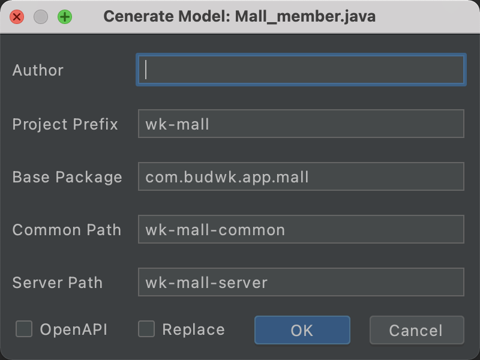

# budwk-codegenerator
BudWk 代码生成器IDEA插件

### 使用说明

* 插件不依赖任何第三方jar包
* 通过 POJO 类生成接口类、接口实现类、控制类
* 需通过 IDEA 打开项目根目录加载项目
* 打开 POJO 类Java文件，在文件内部右击选择"Generate"->"WkCodeGenerator"

### 编译说明

* Mac M1 社区版IDEA，安装插件 Intellij plugin development with Maven （Windows 安装插件 Plugin DevKit）
* 打开项目设置，SDKs 增加 IntelliJ IDEA Community Edition
* 修改 budwk-codegenerator.iml `module type="PLUGIN_MODULE"`
* Build -> Prepare Plugin 